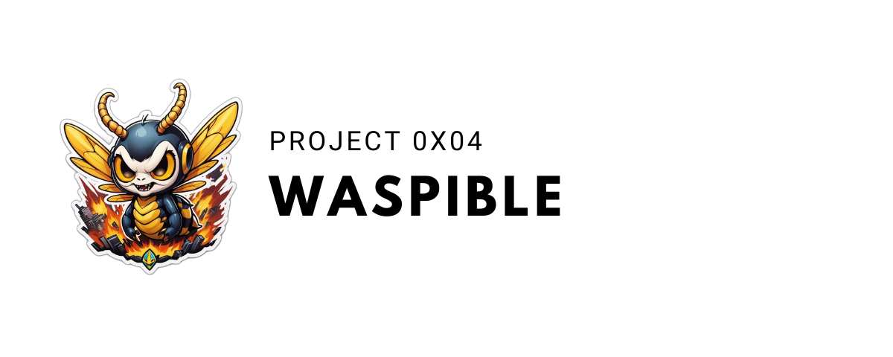

**Project Description**

Simplify the deployment of mission-critical services for small and medium-sized businesses and individuals with our collection of ready-to-use scripts. Install critical software solutions quickly and efficiently to save time and resources.

## Table of contents

1. [Requirements](#requirements)
2. [Installation](#installation)
3. [Usage](#usage)
4. [The playbooks list](#the-playbooks-list)
5. [The variables list](#the-variables-list)
6. [Networks](#networks)
3. [Contribute](#contribute)
4. [License](#license)

## Requirements

You must have the following packages installed: `git`, `ansible`

## Installation

```bash
git clone https://github.com/bartholome-simpson/ansible
cd ansible
```

## Usage

### Start Playbook

```bash
ansible-playbook <PLAYBOOK>.yml -i hosts
```

### Edit Role

```bash
# In ansible repository
vim -S ./roles/<ROLE>/.session.vim
```

## The playbooks list

- `docker_install_bitwarden.yml` 
- `docker_install_dolibarr.yml`
- `docker_install_duplicati.yml`
- `docker_install_freeipa.yml`
- `docker_install_glpi.yml`
- `docker_install_kopia.yml`
- `docker_install_nextcloud.yml`
- `docker_install_nginx.yml`
- `docker_install_openldap.yml`
- `docker_install_qbitorrent.yml`

## The variables list

The varibable name nomenclature takes the following form : `<NAMEA>_<NAMEB>_<NAMEC>` where :

1. `NAMEA` is the application name
2. `NAMEB` is `APP` for the Application or `DB` for the database
3. `NAMEC` is `USERNAME` `USERPASS`, `ADMINAME`, `ADMINPASS`

> [!IMPORTANT]
> There are exceptions, but the name must be clear.


- `BITWARDEN_APP_ADMINPASS_PAGE`    : The password to connect to Bitwarden Admin Page and Database
- `BITWARDEN_ADMIN_PAGE`            : Enable admin page for Bitwarden (yes or no)
- `DOLIBARR_APP_ADMINAME`           : The login of connection to Dolibarr
- `DOLIBARR_ADMIN_PASSWORD`         : The password to connect to Dolibarr
- `DOLIBARR_DB_ADMINPASS`           : The password to connect to Database Dolibarr
- `DUPLICATI_APP_USERPASS`          : The password of connect Duplicati
- `DUPLICATI_APP_USERNAME`          : The login of connext to Duplicati
- `DUPLICATI_APP_VOLUME_SOURCE`     : The source of what we want to back up. Ex : `/home`
- `FREEIPA_APP_DOMAIN`              : The domain name for FreeIPA
- `FREEIPA_APP_HOSTNAME`            : The hostanme for FreeIPA
- `FREEIPA_APP_OS`                  : The OS name for FreeIPA
- `FREEIPA_APP_ADMINPASS`           : The password to connect to FreeIPA
- `FREEIPA_DB_ADMINPASS`            : The database password to connect FreeIPA
- `GLPI_DB_ADMINPASS`               : The password to connect in database of GLPI
- `KOPIA_APP_USERPASS`              : The password to connect in database of GLPI
- `KOPIA_APP_USERNAME`              : The password to connect in database of GLPI
- `NEXTCLOUD_APP_ADMINPASS`         : The password to connect to Nextcloud
- `NEXTCLOUD_DB_ADMINPASS`          : The password to connect in database of Nextcloud
- `NEXTCLOUD_APP_USERNAME`          : The login of connection to Nextcloud
- `NGINX_DB_ADMINPASS`              : The password to connect to Nginx
- `NGINX_DB_USERNAME`               : The login of connection to Nginx
- `OPENLDAP_APP_ADMINPASS`          : The admin password for Openldap
- `OPENLDAP_APP_DOMAIN`             : The domain of your organization. Ex : `myorganization.org`
- `OPENLDAP_APP_MAP_WITH_DOLIBARR`  : If OpenLDAP is mapped with DOLIBARR (Default : "no")
- `OPENLDAP_APP_MAP_WITH_GLPI`      : If OpenLDAP is mapped with GLPI (Default : "no")
- `OPENLDAP_APP_MAP_WITH_NEXTCLOUD` : If OpenLDAP is mapped with NEXTCLOUD (Default : "no")
- `OPENLDAP_APP_ORGANISATION_NAME`  : The organization name. Ex : `myorgamization` 

The interactive varibals are stored in the playbook in : `./<PLAYBOOK>.yml`

## Networks

The default IP Adresse in : `./role/<ROLE_NAME>/defaults/main.yml`

- **`10.0.20.0/24`** : **network_nginx**
	- `10.0.20.10`   : nging_app
	- `10.0.20.11`   : nging_db
	- `10.0.20.21`   : duplicati_app
	- `10.0.20.22`   : nextcloud_app
	- `10.0.20.23`   : dolibarr_app
	- `10.0.20.24`   : phpldapadmin_app
	- `10.0.20.25`   : glpi_app
	- `10.0.20.26`   : bitwarden_app
	- `10.0.20.27`   : qbitorrent_app
	- `10.0.20.28`   : freeipa_app
	- `10.0.20.29`   : kopia_app

- **`10.0.21.0/24`** : **network_duplicati**
	- `10.0.21.10`   : duplicati_app

- **`10.0.22.0/24`** : **network_nextcloud**
	- `10.0.22.10`   : nextcloud_app
	- `10.0.22.11`   : nextcloud_db
	- *`10.0.22.12`*   : *openldap_app*

- **`10.0.23.0/24`** : **network_dolibarr**
	- `10.0.23.10`   : dolibarr_app
	- `10.0.23.11`   : dolibarr_db
	- *`10.0.23.12`*   : *openldap_app*

- **`10.0.24.0/24`** : **network_openldap**
	- `10.0.24.10`   : openldap_app
	- `10.0.24.20`   : phpldapadmin_app

- **`10.0.25.0/24`** : **network_glpi**
	- `10.0.25.10`   : glpi_app
	- `10.0.25.11`   : glpi_db
	- *`10.0.25.12`*   : *openldap_app*

- **`10.0.26.0/24`** : **network_bitwarden**
	- `10.0.26.10`   : bitwarden_app

- **`10.0.27.0/24`** : **network_qbitorrent**
	- `10.0.27.10`   : qbitorrent_app

- **`10.0.28.0/24`** : **network_freeipa**
	- `10.0.28.10`   : freeipa_app
	- `10.0.28.11`   : freeipa_db

- **`10.0.29.0/24`** : **network_kopia**
	- `10.0.29.10`   : kopia_app

## Contribute

As a reminder, this project is still only a draft, and as we are still in the process of creating this image, we welcome all contributions and opinions/improvements.

If you'd like to add a feature, please don't hesitate to :

1. Fork the project
2. Create a new branch (`git checkout -b feature/new-feature`)
3. Commit your changes (`git commit -am 'Add new feature'`)
4. Push the branch (`git push origin feature/new-feature`)
5. Create a pull request

## License

This project is distributed under the MIT License, a permissive open source license that allows anyone to use, modify and distribute the code, as long as the copyright notice and license are included in all copies or substantial parts of the software. This license is renowned for its simplicity and flexibility, offering great freedom to users.
